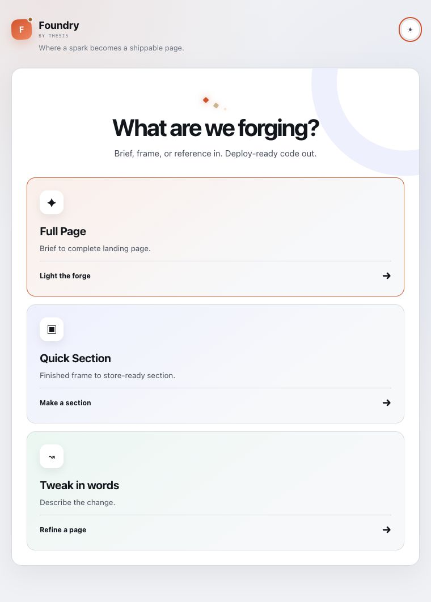
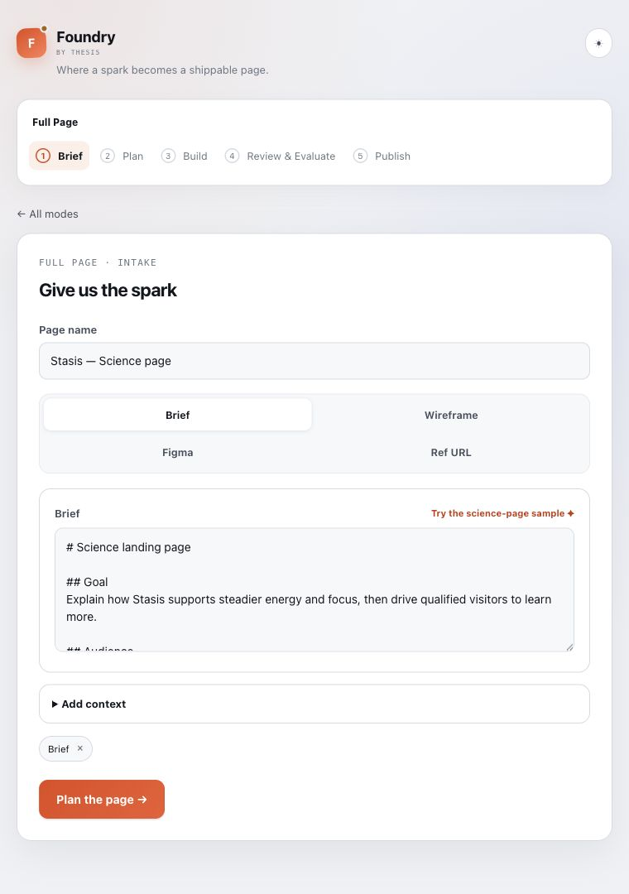
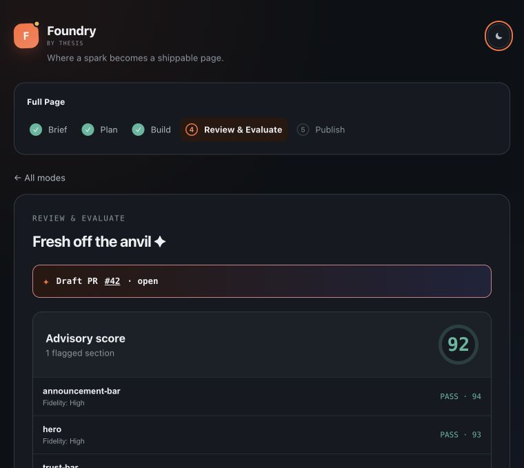
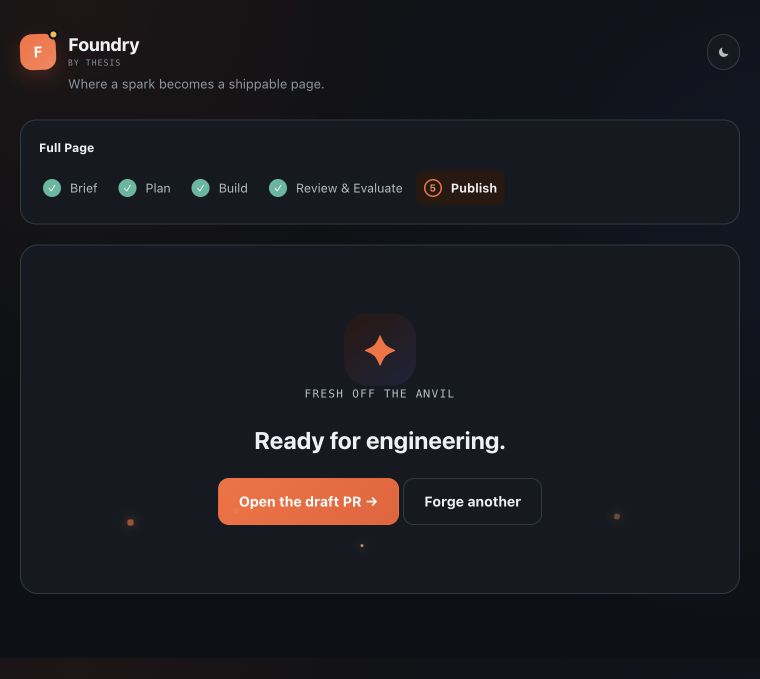
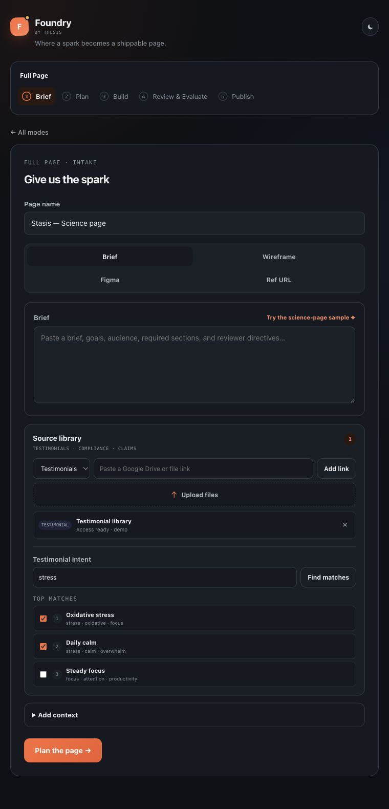
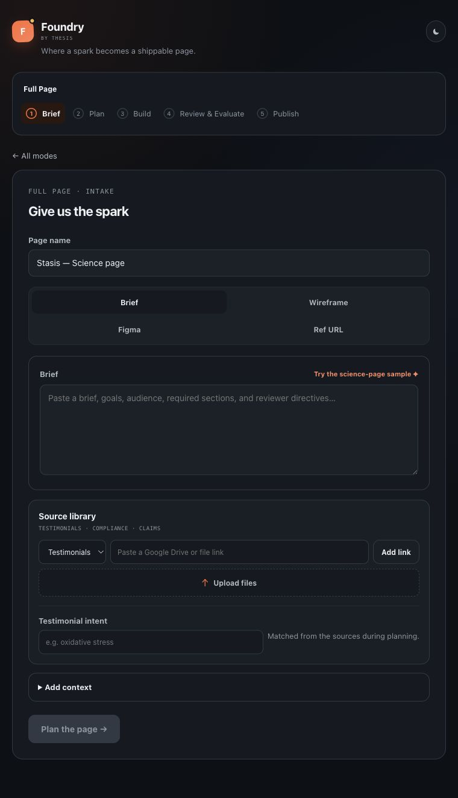
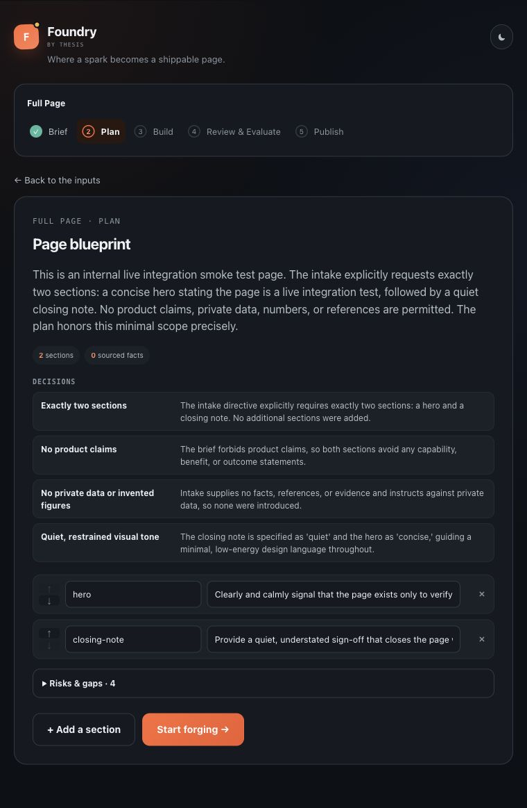

# Foundry — product surface

Foundry is a build-free product surface that forges a brief, wireframe, Figma link, or
reference URL into a planned, reviewable landing page. It also preserves the
quick-section flow and adds a focused plain-language tweak path.

The interface follows the [quiet confidence](docs/quiet-confidence.md) principle:
structure and affordance first, explanation only when it earns its place.

Product decision: [source library and intent-ranked testimonials](docs/product-decisions/source-library.md).

**▶ Try it live: https://trossitter.github.io/Design-Engine/**

The site uses native ES modules and hash routing, so it remains directly deployable to
GitHub Pages without rewrite rules or a build step. The interface is live-only: it calls
`POST /generate-page` and never falls back to fixture plans, scores, previews, or pull
requests. On localhost it uses `http://localhost:8787`; a deployed site must set
`globalThis.FOUNDRY_API_ORIGIN` before the module script loads.

Serve the folder from any static web server, then open `#/` and walk each mode. Opening
`index.html` directly is not supported because browsers block ES-module imports from
`file://` URLs.

Run `npm test` for the route, intake contract, live request mapping, response normalization,
and component checks. The tests stub the network and never consume API tokens.

## Product tour

| Choose a path | Bring the spark |
| --- | --- |
|  |  |

| Review the work | Fresh off the anvil |
| --- | --- |
|  |  |

### Bring trusted source material

### Live engine path

| Live intake | Opus read receipt |
| --- | --- |
|  |  |
